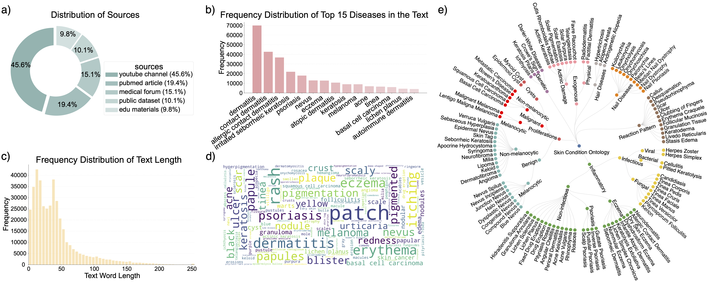

# Derm1M: A Million‑Scale Vision‑Language Dataset Aligned with Clinical Ontology Knowledge for Dermatology
[](https://arxiv.org/abs/2503.14911)
[](#license)
[](#citation)
[](https://huggingface.co/redlessone/DermLIP_ViT-B-16)
[](https://huggingface.co/redlessone/DermLIP_PanDerm-base-w-PubMed-256)


> ⚠️ **Repo under construction**:
> Dataset access will be officially available before the conference date.
> Please contact siyuan.yan@monash.edu if you have questions.

<p align="center">
  
</p>

## Updates

- [x] 01/07/2025: Released DermLIP and DermLIP-PanDerm model weights on Hugging Face.
- [x] 03/07/2025: Released evaluation code for downstream tasks.
- [ ] Training code (coming soon)
- [ ] Dataset (coming soon)


## ✨ TL;DR

**Derm1M** brings **1,029,761 dermatological image–text pairs** -257× more than any previous dermatology vision‑language corpus—covering **390 skin conditions** and **130 clinical concepts** organised in a four‑level expert ontology. The dataset’s rich contextual captions (mean = 41 tokens) include metadata and other clinical contexts, enabling explainable multimodal learning, zero‑/few‑shot diagnosis, cross‑modal retrieval, and visual question answering in realistic settings.

| Aspect                    | Derm1M                                                          |
|---------------------------|-----------------------------------------------------------------|
| Total image–text pairs    | 1 029 761                                                       |
| Unique images             | 403 563                                                        |
| Skin conditions           | 390 (4-level ontology)                                         |
| Clinical concepts         | 130                                                            |
| Average caption length    | 41 words                                                     |
| Ontology structure        | Structured JSON                                                |
| Image sources             | YouTube, PubMed, medical forums, public datasets, teaching slides |


## 🏗️ Repository Layout

```text
dataset_root/
├── images/                # JPEG & PNG images
├── captions.csv          # text + meta per image
├── ontology.json          # disease & concept hierarchy
├── splits/                # train/val indices
```

## 🚀 Pre‑trained Models: **DermLIP**

We provide two CLIP‑style checkpoints trained from scratch on **Derm1M**:

| Model ID            | Vision Encoder | Text Encoder | Zero‑shot Avg† | R\@10 I→T (hold‑out) |
| ------------------- | -------------- | ------------ | -------------- | -------------------- |
| **DermLIP‑B/16**    | ViT‑B/16       | GPT77        | 56.1 %         | 40.7 %               |
| **DermLIP‑PanDerm** | PanDerm‑B      | PMB256       | **58.8 %**     | **59.9 %**           |


## 📊 Key Benchmarks

| Task                                       | Metric    | DermLIP‑PanDerm |  Best Prior SOTA  |       Δ      |
| :----------------------------------------- | :-------- | :-------------: | :---------------: | :----------: |
| Zero‑shot classification (avg. 4 datasets) | Accuracy  |    **58.8 %**   | BiomedCLIP 44.1 % | **+14.7 pp** |
| Few‑shot (10 % labels) linear probe         | Accuracy  |    **69.6 %**   |    MONET 66.9 %   |  **+2.7 pp** |
| Cross‑modal retrieval (SkinCAP)            | R\@10 I→T |    **20.2 %**   |    MONET 14.2 %   |  **+6.0 pp** |

*All metrics are taken directly from Tables 2–4 of the Derm1M paper.*

## 💾 Data Access

The dataset is undergoing final review and will be released for **non‑commercial research under CC BY‑NC‑4.0**. Join the [wait‑list](https://forms.gle/derm1m‑access) or watch this repo for updates.

## 📝 Getting Started

```bash
git clone https://github.com/SiyuanYan1/Derm1M.git
cd Derm1M

conda create -n Derm1M python=3.9.20
conda activate Derm1M
pip install -r requirements.txt
```


<a id="citation"></a>
## 📚 Citation


If you find our work useful, please cite:

```bibtex
@misc{yan2025derm1m,
  title        = {Derm1M: A Million‑Scale Vision‑Language Dataset Aligned with Clinical Ontology Knowledge for Dermatology},
  author       = {Siyuan Yan and Ming Hu and Yiwen Jiang and Xieji Li and Hao Fei and Philipp Tschandl and Harald Kittler and Zongyuan Ge},
  year         = {2025},
  eprint       = {2503.14911},
  archivePrefix= {arXiv},
  primaryClass = {cs.CV},
  url          = {https://arxiv.org/abs/2503.14911}
}

@article{yan2025multimodal,
  title={A multimodal vision foundation model for clinical dermatology},
  author={Yan, Siyuan and Yu, Zhen and Primiero, Clare and Vico-Alonso, Cristina and Wang, Zhonghua and Yang, Litao and Tschandl, Philipp and Hu, Ming and Ju, Lie and Tan, Gin and others},
  journal={Nature Medicine},
  pages={1--12},
  year={2025},
  publisher={Nature Publishing Group}
}
```
<a id="license"></a>
## 🛡️ License


Derm1M is released under the **Creative Commons Attribution‑NonCommercial 4.0 International** license. Commercial use requires separate permission.


